# Vigilo

**AI-powered penetration-testing pipeline.** Specialized agents run a full vulnerability
assessment of a web application — from reconnaissance through exploitation to automated
remediation — and produce an evidence-backed report plus fix branches for every confirmed
finding.

Vigilo was built by **CERT-EU** so security teams can run repeatable, agent-driven pentests
against their own code and services. It ships two ways to run:

- **Web platform (recommended)** — a multi-user API + web UI. Sign in, attach a repository
  (upload or GitLab), pick what to run, execute asynchronously, and browse findings, reports
  and dashboards. This is the way most people should use Vigilo.
- **Command-line** — run the full pentest pipeline directly against a repository (and an optional
  live URL) with `make`; no web platform required. Also offers a grey-box (no-source) mode.

The pipeline combines Temporal-orchestrated agents with an agentic coding CLI (Claude Code,
OpenAI Codex, or OpenCode), Playwright browser testing, and source-code analysis. Each agent
focuses on a specific vulnerability class, agents share findings with each other, and an
adversarial critic re-checks every finding before it reaches the report.

> **Licence:** [EUPL-1.2](#licence) · Copyright © 2026 European Union. See [`LICENSE`](LICENSE).

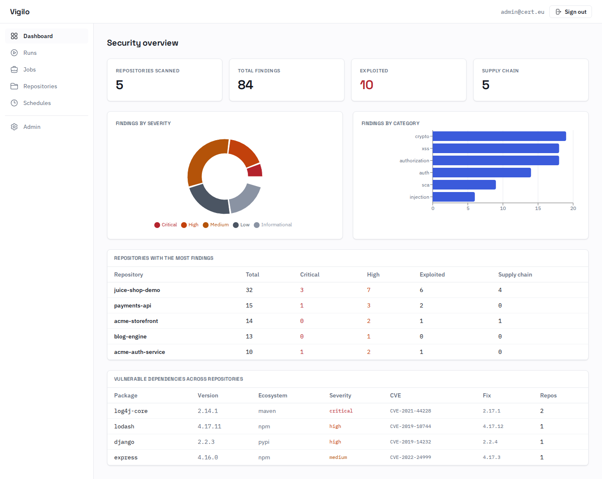

*The global dashboard — findings by severity and category, the most-affected repositories, and vulnerable dependencies aggregated across every scan.*

---

## Table of contents

**Understand it**

- [What Vigilo does](#what-vigilo-does)
- [Two ways to test: white-box and grey-box](#two-ways-to-test-white-box-and-grey-box) — [White-box](#white-box--source-code-review) · [Grey-box](#grey-box--penetration-testing) · [Which one do I want?](#which-one-do-i-want)
- [Architecture](#architecture)

**Install and run it**

- [Getting started (web platform)](#getting-started-web-platform) — [Prerequisites](#prerequisites) · [1. Clone and configure](#1-clone-and-configure) · [2. Start the full stack](#2-start-the-full-stack) · [3. Database migrations](#3-database-migrations) · [4. Sign in and run a scan](#4-sign-in-and-run-a-scan)
- [Deployment options](#deployment-options) — [Let's Encrypt (default)](#option-1--traefik--lets-encrypt-default) · [Your own ACME CA](#option-2--traefik--your-own-acme-ca) · [No Traefik / plain HTTP](#option-3--no-traefik-your-own-reverse-proxy-or-plain-http)
- [Run it directly (standalone pipeline)](#run-it-directly-standalone-pipeline) — [1. Configure](#1-configure) · [2. Point it at a target and scan](#2-point-it-at-a-target-and-scan) · [3. Output](#3-output)
- [Docker Compose files, explained](#docker-compose-files-explained)

**Configure it**

- [Pipeline modes](#pipeline-modes)
- [Authentication & access model](#authentication--access-model)
- [Configuration reference](#configuration-reference) — [Required](#required-platform) · [First admin](#first-admin-bootstrap-first-boot-only) · [Model backend](#model-backend-worker) · [Email](#email-notifications) · [GitLab](#gitlab-integration-optional)

**Go deeper**

- [How the pipeline works](#how-the-pipeline-works) — [White-box pipeline](#white-box-pipeline) · [Grey-box pipeline](#grey-box-pipeline) · [Output](#output)
- [API reference](#api-reference)
- [Development](#development)
- [Licence](#licence)

---

## What Vigilo does

You point Vigilo at a web application (and, in white-box mode, its source code). It then:

1. **Recons** the target — maps the source, dependencies, and the live app.
2. **Finds** vulnerabilities with parallel agents, each specialised in one class (injection,
   XSS, auth, SSRF, authorization, GraphQL, WebSocket, cryptography, and supply-chain/SCA).
3. **Exploits** the findings to prove they are real, with captured evidence and screenshots.
4. **Critiques** every finding adversarially — de-inflating overclaimed severities, collapsing
   duplicates, and moving low-value items to a hardening appendix. Nothing is silently dropped.
5. **Remediates** — generates a fix branch and patch per confirmed finding, and can push them
   upstream and open one merge request each.
6. **Reports** — an executive summary with evidence, grouped findings, and (grey-box) blue-team
   detection hints.

---

## Two ways to test: white-box and grey-box

Vigilo can test an application in two different ways. The difference is simply **how much you
give it**: with or without the source code. Everything else — the agents, the exploitation, the
adversarial critique, the report — follows from that choice.

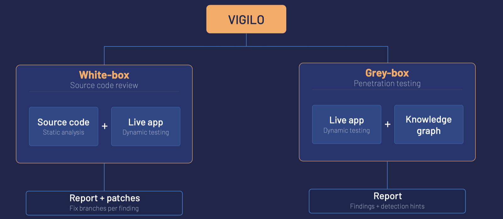

*The two paths. **White-box** gets the source code *and* the running app, and returns a report plus working patches. **Grey-box** only gets the running app, and returns a report plus detection hints for your blue team.*

### White-box — source code review

**You give it:** a Git repository, and (optionally, but strongly recommended) a URL where that
same application is running.

This is the mode to use on **your own software** — code your team wrote or maintains, and can fix.
Vigilo reads the source to find where the bugs actually are, then tries to trigger them against
the live app to prove they are real rather than theoretical. Because it has the code, it can go
one step further and write the fix: one branch and one patch per confirmed finding, optionally
pushed upstream as merge requests.

**You get back:** a report with evidence, plus fix branches you can review and merge.

### Grey-box — penetration testing

**You give it:** a URL, and optionally credentials to log in with. **No source code.**

This is the mode to use on **software you cannot see inside** — a third-party product, a vendor
SaaS, a black-box service, or simply an app whose code you don't have. Vigilo behaves like an
external attacker who has been handed a login: it explores the application, records everything it
learns in a knowledge graph, and lets a scheduler decide what to probe next based on that graph.
It cannot propose code patches, because it has never seen the code — so instead it hands your
defenders what they need to *catch* the attack: WAF rules, log signatures and SIEM queries for
every confirmed finding.

("Grey-box" rather than "black-box" because you normally do give it valid credentials — testing
only the logged-out surface of an application misses most of it.)

**You get back:** a report with evidence, plus detection-engineering hints for your blue team.

### Which one do I want?

| Your situation | Mode | Why |
|----------------|------|-----|
| It's our code, in our Git | **White-box** | Deepest coverage, and you get patches you can merge. |
| It's a vendor product / SaaS we bought | **Grey-box** | You have no code to give it, and no way to patch it anyway. |
| We have the code, but can't deploy a running copy | **White-box** | Still works. Findings are confirmed at source level instead of over the network. |
| We have a running app but no code access | **Grey-box** | Exactly what it's built for. |
| We want to know what our SOC would actually see | **Grey-box** | Only grey-box produces detection hints. |

Both modes run from the command line. The **web platform currently runs white-box**; grey-box is
CLI-only for now. Details of what each pipeline does internally are in
[How the pipeline works](#how-the-pipeline-works).

---

## Architecture

The web platform is a set of containers that talk over a private Docker network. A job created
in the UI/API starts a real Temporal workflow; a worker runs the pipeline against the repo on a
shared volume and writes the report and logs back.

| Component | What it is | Role |
|-----------|-----------|------|
| **UI** | React + Vite + TypeScript SPA (nginx) | The web app. Talks only to the API. |
| **API** | FastAPI (`src/webapi/`) | Auth, repositories, jobs, runs, reports, dashboards, scheduling, email. Starts pipeline runs. |
| **Worker** | Python Temporal worker (built from the root `Dockerfile`) | Executes the pentest pipeline (the same code the CLI runs). |
| **Temporal** | Temporal server (`start-dev`) | Orchestrates the long-running pipeline workflow and its activities. |
| **Postgres** | PostgreSQL 16 | The platform's system of record (users, repos, jobs, runs, metrics). |
| **MailHog** | Mail catcher | Dev SMTP sink for invitation + report emails. Internal-only; swap for a real relay in production. |
| **Traefik** | TLS reverse proxy | The **only** service with published ports (`80` → redirects to `443`, `443`). Terminates TLS (certificates from Let's Encrypt, or any ACME CA you point it at) and routes the public hostname to the UI. Optional — see [Deployment options](#deployment-options). |

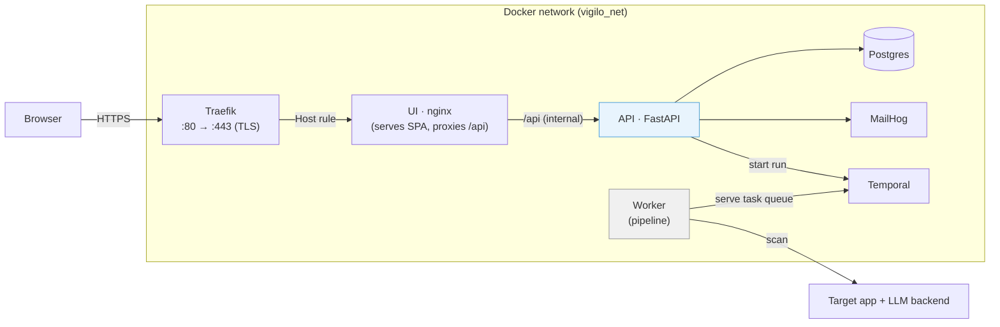

**Exposure:** only Traefik publishes host ports (`80`/`443`). The UI is the sole public
router (`https://$VIGILO_HOSTNAME`); the API, Postgres, Temporal and MailHog have **no
published port and no router** — they are reachable only on the internal `vigilo_net`
network. The browser never talks to the API directly: the UI's nginx proxies `/api` to it
internally. HTTP is redirected to HTTPS, and HSTS + anti-clickjacking/sniffing headers are
applied by Traefik. If you replace Traefik with your own reverse proxy, the internal layout
is unchanged — only the front door moves. See [Deployment options](#deployment-options).

---

## Getting started (web platform)

### Prerequisites

- **Docker** with the Compose plugin (`docker compose`).
- **One LLM backend credential** for the worker to actually run scans — an Anthropic API key
  (or AWS Bedrock / Azure Foundry), or an OpenAI/Codex key, or a LiteLLM gateway. Without this
  the platform boots but runs cannot execute. See [Configuration reference](#configuration-reference).

### 1. Clone and configure

```bash
git clone <your-fork-url> vigilo && cd vigilo
cp env.sample .env
```

Edit `.env` and set, at minimum:

```bash
# Public hostname — Traefik serves the UI here over HTTPS
VIGILO_HOSTNAME=vigilo.example.com

# Platform secrets (required)
VIGILO_JWT_SECRET=<a long random string>       # signs login tokens (>= 32 bytes)
VIGILO_FERNET_KEY=<generated key>              # encrypts stored per-user credentials
POSTGRES_PASSWORD=<a strong password>

# First admin, created on first boot (leave blank to skip auto-creation)
VIGILO_FIRST_ADMIN_EMAIL=admin@example.com
VIGILO_FIRST_ADMIN_PASSWORD=<change me>

# One model backend so scans can run (example: Anthropic)
ANTHROPIC_API_KEY=sk-ant-...

# Contact address for the certificate authority. Must be real — Let's Encrypt
# rejects @example.com. Certificates come from Let's Encrypt unless you set
# ACME_CASERVER to a different ACME server.
ACME_EMAIL=you@your-domain.example
```

`VIGILO_HOSTNAME` must resolve to this host in DNS, and the certificate authority must be
able to reach it on port 80 to complete the ACME HTTP-01 challenge.

No public hostname? Certificates from an internal CA? Already running your own reverse
proxy? Traefik is optional — see [Deployment options](#deployment-options).

Generate the Fernet key (no dependencies required):

```bash
python3 -c "import base64,os;print(base64.urlsafe_b64encode(os.urandom(32)).decode())"
```

`env.sample` documents every backend (Anthropic / Bedrock / Foundry / Codex / OpenCode),
corporate-proxy settings, GitLab integration, grey-box knobs, and SMTP.

### 2. Start the full stack

```bash
docker compose --env-file .env -f deploy/docker-compose.full.yml up --build -d
```

This builds and starts Traefik, Postgres, MailHog, Temporal, the API, the UI, and the worker.
Traefik requests a TLS certificate on first boot and serves the UI at
**`https://$VIGILO_HOSTNAME`** (HTTP is redirected to HTTPS). Only ports 80/443 are published;
everything else is internal.

> **No hostname or certificate yet?** Run the same stack over plain HTTP instead — add
> `-f deploy/docker-compose.plain.yml` to the command above and open
> `http://localhost:8080`. See [Deployment options](#deployment-options).

> **Working on Vigilo itself?** You don't need this stack at all — run the API and UI
> directly with the fake engine, which needs no Docker or Temporal. See
> [Development](#development).

### 3. Database migrations

**No manual step needed.** The API runs Alembic (`alembic upgrade head`) automatically on boot
(`VIGILO_RUN_MIGRATIONS_ON_START=true`, the default), so a fresh or existing database is brought
up to the current schema. To run migrations manually (e.g. in CI):

```bash
docker compose -f deploy/docker-compose.full.yml exec api python -m scripts.run_migrations upgrade
```

### 4. Sign in and run a scan

1. Open the UI at **`https://$VIGILO_HOSTNAME`** and sign in as the first admin.
2. **Repositories** → attach a source (upload a `.zip`/`.tar.gz` or folder, or connect a GitLab repo).
3. **Jobs** → create a job (repository + [pipeline mode](#pipeline-modes) + optional target URL),
   then **Run** it.
4. Watch progress on the **Run detail** page (phase spine + live log). When it finishes, open the
   report; opt in to "email me the report" to receive it (in dev, MailHog catches it — it's
   internal-only, so port-forward to read it, or point SMTP at a real relay in production).

To stop everything: `docker compose -f deploy/docker-compose.full.yml down` (add `-v` to also
wipe the Postgres/Temporal/job volumes).

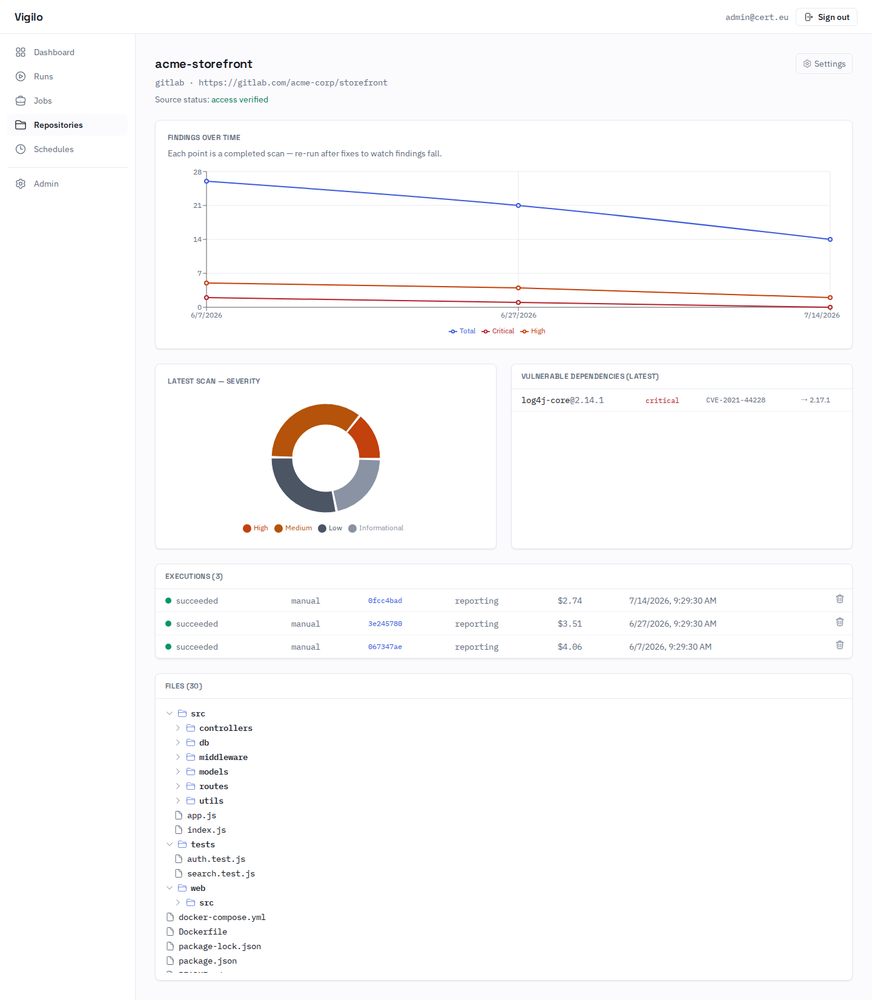

*A repository's detail page: findings-over-time as you re-scan, the latest severity breakdown, vulnerable dependencies, past executions, and a browse-only file explorer.*

---

## Deployment options

By default Vigilo puts **Traefik** in front of the stack and gets a TLS certificate from
**Let's Encrypt**. That fits a server with a public DNS name, but it is not the only way to
run it. All the options below use the same `deploy/docker-compose.full.yml` — there is one
source of truth, and you change behaviour with environment variables or a small override
file, never by editing the compose file.

| Your situation | What to do |
|----------------|------------|
| Public server with a DNS name | Nothing extra. This is the default. |
| Your organisation runs its own ACME CA | Set `ACME_CASERVER` in `.env`. |
| You already run a reverse proxy or load balancer | Skip Traefik, publish the UI on a local port, terminate TLS in your proxy. |
| Trying Vigilo out, no hostname or certificate | Skip Traefik and use plain HTTP. |

### Option 1 — Traefik + Let's Encrypt (default)

```bash
docker compose --env-file .env -f deploy/docker-compose.full.yml up --build -d
```

Set two things in `.env`:

```bash
VIGILO_HOSTNAME=vigilo.example.com     # the public name of this host
ACME_EMAIL=you@your-domain.example     # a real address; Let's Encrypt rejects @example.com
```

Two things must be true before the first start, or certificate issuance fails:

- `VIGILO_HOSTNAME` resolves to this host.
- Let's Encrypt can reach this host on **port 80** — that is where the ACME HTTP-01
  challenge is answered. Open it in your firewall.

Certificates are stored in the `acme_data` Docker volume, so they are reused across
restarts and renewed automatically. Deleting that volume forces a fresh issuance.

### Option 2 — Traefik + your own ACME CA

If your organisation issues certificates from an internal ACME server, point Vigilo at it:

```bash
ACME_CASERVER=https://acme.your-internal-ca.example/acme/directory
```

Everything else is identical to option 1: the CA still has to reach this host on port 80
for the HTTP-01 challenge. Browsers on your network must already trust that CA's root
certificate — Vigilo does not distribute it.

### Option 3 — No Traefik (your own reverse proxy, or plain HTTP)

Layer the `plain` override on top of the full stack. It stops Traefik from starting and
publishes the UI's own nginx on a host port instead:

```bash
docker compose --env-file .env \
  -f deploy/docker-compose.full.yml \
  -f deploy/docker-compose.plain.yml \
  up --build -d
```

The UI is then at **`http://localhost:8080`**. Change the port with `VIGILO_HTTP_PORT`.
Nothing else changes: that nginx serves the web app and proxies `/api` to the API over the
internal network, exactly as it does behind Traefik.

**If you have your own reverse proxy** (nginx, HAProxy, Apache, a cloud load balancer),
point it at that port and terminate TLS there. Two extra steps:

```bash
VIGILO_HTTP_PORT=127.0.0.1:8080                # only reachable from this machine
VIGILO_UI_BASE_URL=https://vigilo.example.com  # the public URL, used in email links
```

Binding to `127.0.0.1` keeps the unencrypted port off the network when your proxy runs on
the same host. `VIGILO_UI_BASE_URL` matters because invitation and report emails would
otherwise link to the wrong address.

One thing you take over: the HTTP→HTTPS redirect and the security headers (HSTS,
`X-Content-Type-Options`, `X-Frame-Options: DENY`, `Referrer-Policy`) are applied by
Traefik in options 1 and 2. Without Traefik, configure them in your own proxy.

Already have certificate **files** rather than an ACME CA? Use this option and load them
into your own proxy — the bundled Traefik only knows how to fetch certificates over ACME.

> **Security note.** Without TLS, logins and reports travel in clear text. Plain HTTP is
> fine on `localhost` for a trial, and fine behind a proxy that terminates TLS. Do not
> publish port 8080 to an untrusted network.

### What is exposed, in every option

Only the front door changes. The API, Postgres, Temporal and MailHog never get a published
port or a public route in any of these setups — the browser always reaches the API through
the UI's internal `/api` proxy.

---

## Run it directly (standalone pipeline)

Vigilo is autonomous pentesting you can run straight from the command line: point it at a code
repository (optionally with a live URL), and it runs the full recon → vulnerability analysis →
exploitation → adversarial critique → remediation → report pipeline in Docker and writes an
evidence-backed report you can read locally. All you need is Docker and one model backend.

### 1. Configure

```bash
cp env.sample .env
```

Set **one** model backend in `.env`:

- **Anthropic (Claude)** — `ANTHROPIC_API_KEY=...` (or AWS Bedrock / Azure Foundry variables)
- **OpenAI-compatible (Codex)** — `VIGILO_EXECUTOR=codex`, `CODEX_BASE_URL=...`, `CODEX_API_KEY=...`
- **Local / self-hosted (OpenCode + LiteLLM)** — `VIGILO_EXECUTOR=opencode`, `LITELLM_BASE_URL=...`, `OPENCODE_*_MODEL=...`

`env.sample` documents every backend and the optional GitLab push settings. Behind a corporate
proxy, set `HTTP_PROXY`/`HTTPS_PROXY` and keep `temporal` in `NO_PROXY`.

> **Model endpoint on an internal/corporate TLS certificate?** The image ships the stock public
> CA bundle, so the container will not trust your endpoint even when your host does — and the
> failure reads like a network or streaming problem rather than a certificate one, e.g.
> `stream disconnected before completion: error sending request for url (...)`. Check it with:
>
> ```bash
> docker run --rm --entrypoint sh vigilo-worker:latest \
>   -c 'curl -sv https://your-endpoint/v1/models 2>&1 | grep -i "verify result"'
> ```
>
> `unable to get local issuer certificate` confirms it. You then need your CA chain inside the
> container's trust store — bind-mount the chain into the image and install it there.

### 2. Point it at a target and scan

```bash
make build DIR=/path/to/repo             # load the target repository into the scanner image
make scan                                # white-box, code-only analysis
make scan URL=https://target.example     # also exercise the running app (recon + exploitation)
make scan URL=https://target.example PUSH=1   # additionally push fix branches + open MRs (needs GITLAB_TOKEN)
```

For targets that need authentication or scoping, add a per-scan config (`configs/*.yaml` — login
flow or session-cookie reuse for 2FA/SSO, in/out-of-scope rules, tuning); see
`configs/example-config.yaml`.

Useful targets (`make help` lists all):

| Target | Purpose |
|--------|---------|
| `make build DIR=…` | Load the target repository into the scanner image. |
| `make scan [URL=…] [PUSH=1]` | Run the full pipeline (code-only if no `URL`). |
| `make resume W=<workspace> [URL=…]` | Resume a scan; already-completed phases are skipped. |
| `make greybox URL=… CREDS=configs/creds.yaml` | Grey-box scan — live app only, no source code. |
| `make stop` / `make clean` | Stop containers / remove outputs + volumes. |

### 3. Output

Results are written into the target repo under `.vigilo/<session-id>/`:

```
.vigilo/<session-id>/
├── workflow.log                                     # human-readable run log
├── session.json                                     # cost / tokens / duration
├── agents/                                           # per-agent logs
└── deliverables/
    ├── comprehensive_security_assessment_report.md   # the final report
    ├── findings_index.json / findings_critique.json  # structured findings
    ├── patches/                                       # a fix patch per confirmed finding
    └── screenshots/                                   # captured evidence
```

A live workflow view is available at **http://localhost:8233** while a scan is running.

---

## Docker Compose files, explained

Vigilo has **two independent ways to run**, and each has its own compose files. Neither is
deprecated — pick the one that matches how you want to work, and use exactly one of them at a
time.

### The platform (`deploy/`) — API + web UI, multi-user

| File | For | When to use |
|------|-----|-------------|
| `deploy/docker-compose.full.yml` | **Full platform** — Traefik (TLS) + Postgres + API + UI + MailHog + Temporal + Worker | **The normal way to run Vigilo.** Serves the UI at `https://$VIGILO_HOSTNAME`; only Traefik publishes ports (80/443), everything else is internal. |
| `deploy/docker-compose.plain.yml` | *Override* for the full platform | Layer it on to run **without Traefik and without TLS**, publishing the UI on a host port. See [Deployment options](#deployment-options). |
| `deploy/docker-compose.api.yml` | **API only** (Postgres + API, no UI) | Headless / external API consumers, or when you only need the API surface. |

### The command-line pipeline (repo root) — single-user, no web UI

These came first and are still fully supported. They run the same pentest pipeline as the
platform's worker, just driven by `make` instead of the API — no database, no accounts, no UI.
Use them when you want a one-off scan on your own machine and a report on disk.

| File | For | When to use |
|------|-----|-------------|
| `docker-compose.yml` (root) | **White-box CLI** worker + Temporal | Used by `make build` / `make scan` (see [Run it directly](#run-it-directly-standalone-pipeline)). |
| `docker-compose.greybox.yml` | **Grey-box CLI** — Temporal + SurrealDB + Surrealist + worker | Grey-box (no-source) scans via `make greybox`. |
| `docker-compose.opencode.yml` | *Override* for grey-box | Layer onto `docker-compose.greybox.yml` to use the OpenCode executor. |
| `docker-compose.codex.yml` | *Override* for grey-box | Layer onto `docker-compose.greybox.yml` to use the OpenAI Codex executor. |

The three override files (`plain`, `opencode`, `codex`) are never used alone — they are layered
onto a base file with a second `-f`, e.g.
`docker compose -f docker-compose.greybox.yml -f docker-compose.codex.yml build worker`. The
`make` targets wire this up for you.

> **Don't run two copies of the platform on one host.** `deploy/docker-compose.full.yml`
> attaches to a fixed Docker network called `vigilo_net`, so a second copy started under a
> different Compose project name joins the *same* network. Service names like `api` and
> `postgres` then resolve to either stack at random, which produces baffling intermittent
> failures. (The CLI stacks use a separate network, `vigilo-net`, and don't collide with the
> platform.)

---

## Pipeline modes

Every job picks one **stage preset**. Exploitation is always welded to vulnerability analysis
(there is no "find but don't exploit" mode), and the adversarial findings critique always runs —
neither can be disabled.

| Preset | Runs | Use when |
|--------|------|----------|
| **`vuln`** | Vulnerability analysis + exploitation + critique | You want findings only — the fastest, cheapest scan. |
| **`vuln_patch`** | `vuln` **+ remediation** (fix branches, patches, optional MRs) | You want findings *and* proposed fixes. |
| **`full`** | `vuln_patch` **+ SCA + integrity analysis + cross-type chain exploitation** | A complete assessment, including supply-chain and chained exploits. |

Independently of the preset, you choose the **analysis mode** and the **LLM backend**:

- **White-box** (source + live app) vs **grey-box** (live app only). The platform runs white-box;
  grey-box is available from the CLI.
- **Executor / backend** — `claude` (Claude Code), `codex` (OpenAI Codex), or `opencode` (local
  models via LiteLLM). One `VIGILO_EXECUTOR` variable selects it; the white-box image bundles both
  the `claude` and `codex` CLIs, so switching needs no rebuild. See
  [Configuration reference](#configuration-reference).

---

## Authentication & access model

- **Login** is email + password (JWT bearer tokens, via `fastapi-users`). There is **no public
  self-signup** — access is invitation-based.
- **First admin** is bootstrapped from `VIGILO_FIRST_ADMIN_EMAIL` / `_PASSWORD` on first boot.
- **Roles:** `admin` and `user`. Admins manage users, invitations, and global config (models,
  executor, concurrency, SMTP). Users create repositories, jobs, and runs.
- **Invitations:** an admin invites by email; the invitee receives an accept link (emailed when
  SMTP is configured, otherwise the link is returned to the admin) and sets their own password.
- **Passwords:** users can change their own password (which invalidates their other sessions);
  admins can trigger a reset; a public forgot/reset-password flow issues a one-time token.
- **Per-user credentials** (GitLab tokens, session cookies) are stored **encrypted** (Fernet) and
  are never returned by the API.
- **Repository privacy:** a repository can be marked `is_private`. Private repos — and all their
  jobs, runs, reports, and metrics — are visible only to the owner, explicitly granted users, and
  admins. Non-private repos are visible to the whole team. Owners/admins grant or revoke access by
  email or user id.

---

## Configuration reference

All platform settings are environment variables read by `src/webapi/settings.py`. `env.sample` is
a copy-paste starting point; **[`deploy/config-reference.md`](deploy/config-reference.md) is the
exhaustive reference.** The most important ones:

### Required (platform)

| Variable | Meaning |
|----------|---------|
| `VIGILO_JWT_SECRET` | JWT signing secret (≥ 32 random bytes). |
| `VIGILO_FERNET_KEY` | base64 Fernet key encrypting stored credential secrets. |
| `VIGILO_DATABASE_URL` | `postgresql+asyncpg://…` — **Postgres is the only supported runtime datastore** (SQLite is used only by the test suite). Set automatically in the full compose. |
| `POSTGRES_PASSWORD` | Password for the bundled Postgres (used to build `VIGILO_DATABASE_URL` in compose). |

### First-admin bootstrap (first boot only)

| Variable | Meaning |
|----------|---------|
| `VIGILO_FIRST_ADMIN_EMAIL` / `VIGILO_FIRST_ADMIN_PASSWORD` | Creates the initial admin if no user with that email exists. |

### Model backend (worker)

Pick one backend; `VIGILO_EXECUTOR` (or auto-detection from which credentials you set) chooses it.

| `VIGILO_EXECUTOR` | Backend | Works with |
|-------------------|---------|------------|
| `claude` (default) | Claude Code CLI | Anthropic API · AWS Bedrock · Azure Foundry |
| `codex` | OpenAI Codex CLI | OpenAI · Azure Foundry · any OpenAI-compatible endpoint (LiteLLM) |
| `opencode` | OpenCode CLI | Local / self-hosted models via LiteLLM |

Key credentials: `ANTHROPIC_API_KEY` (Claude); `CODEX_BASE_URL` + `CODEX_API_KEY` (Codex);
`LITELLM_BASE_URL` + `LITELLM_API_KEY` + `OPENCODE_*_MODEL` (OpenCode). Behind a corporate proxy,
set `HTTP_PROXY`/`HTTPS_PROXY` and keep `temporal` in `NO_PROXY`. Full per-backend examples
(Bedrock, Foundry, internal CA certs, pricing tables) are in `env.sample` and
[`deploy/config-reference.md`](deploy/config-reference.md).

### Email (notifications)

| Variable | Default | Meaning |
|----------|---------|---------|
| `VIGILO_SMTP_HOST` | `mailhog` (in full compose) | SMTP server. Unset → notifications are silently disabled. |
| `VIGILO_SMTP_PORT` | `1025` (MailHog) / `25` | SMTP port. |
| `VIGILO_SMTP_FROM` | `vigilo@example.com` | Sender address. |
| `VIGILO_SMTP_USER` / `_PASSWORD` / `_STARTTLS` | unset / unset / `false` | Set for authenticated SMTP against a real relay (typically port 587). |
| `VIGILO_UI_BASE_URL` | `https://$VIGILO_HOSTNAME` | Public UI URL used in invite + report email links. |

### GitLab integration (optional)

| Variable | Default | Meaning |
|----------|---------|---------|
| `GITLAB_URL` | `https://gitlab.example.com` | GitLab base URL for push/MR (CLI) and clone. |
| `GITLAB_TOKEN` | — | Deployment-wide token enabling `PUSH=1` + MR creation (CLI). |

> In the platform, GitLab repos are attached with a per-user, encrypted token entered in the UI;
> `push_patches` (opt-in, per repo) pushes fix branches + opens MRs back to origin.

---

## How the pipeline works

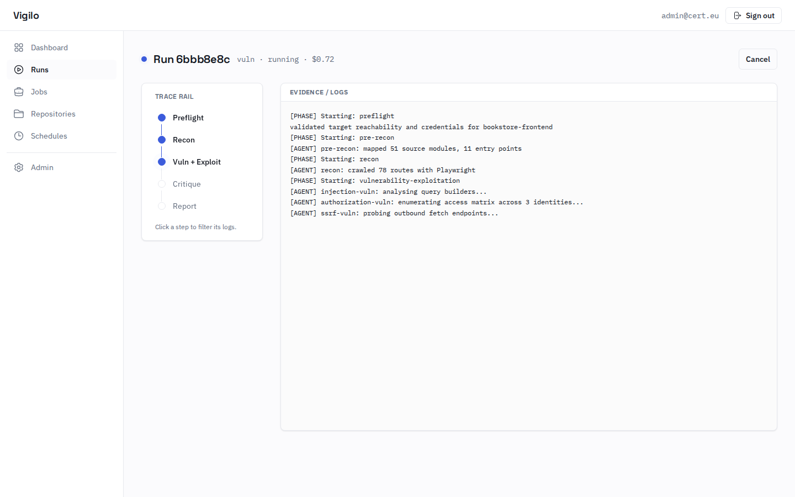

*A run in progress: the **Trace Rail** shows the active pipeline step while the evidence/log pane streams live.*

### White-box pipeline

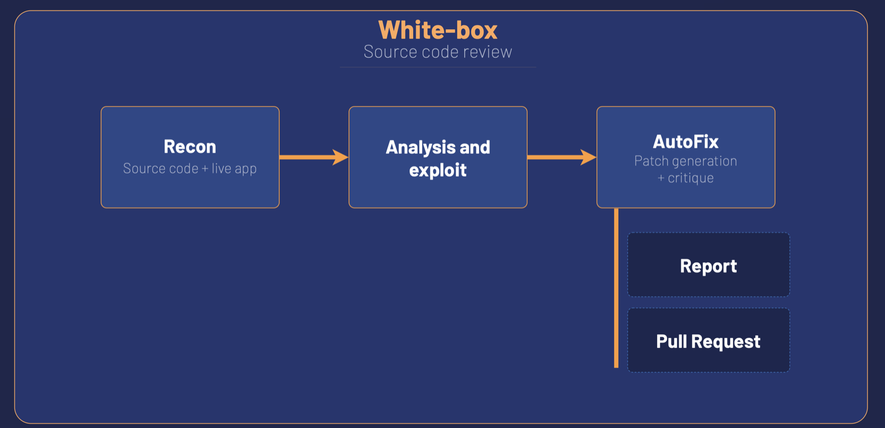

*White-box at a glance: recon the source and the live app → find and exploit → generate and critique patches → report and (optionally) a pull request.*

A Temporal workflow orchestrates specialised agents across the full pentest lifecycle:

```
Phase 1: Preflight       — validate target, credentials, environment
Phase 2: Pre-Recon       — deep source code + architecture analysis
Phase 2b: SCA            — supply-chain analysis (dependencies, lockfiles)
Phase 3: Recon           — live app reconnaissance with Playwright
Phase 4: Vuln Analysis   — parallel agents, each a different vulnerability scope
Phase 5: Exploitation    — parallel agents prove findings with evidence
Phase 5b: Chain Exploit  — cross-type vulnerability chaining
Phase 5c: Critique       — adversarial review of every finding
Phase 6: Remediation     — automated patches on per-vulnerability fix branches
Phase 6a-c: Push & MR    — export patches, push upstream, create merge requests
Phase 7: Report          — executive summary with evidence + screenshots
```

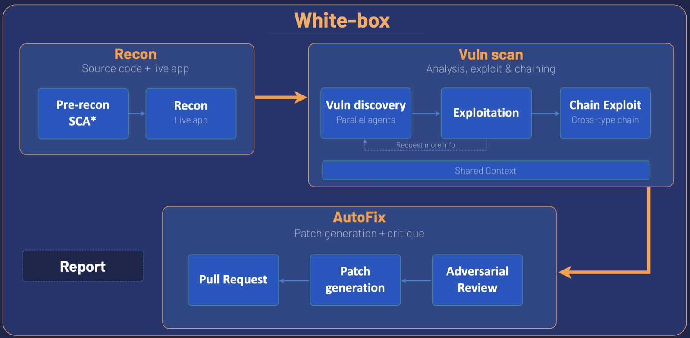

*The same pipeline in detail. Vuln discovery runs as parallel agents over a **shared context**, and a stuck exploit agent can loop back once to request more information. Everything then passes through **adversarial review** before any patch is written. (`SCA` — supply-chain analysis — runs in the `full` preset.)*

- **Inter-agent collaboration.** A shared knowledge base (`shared_context.json`) accumulates
  discoveries; a unified index (`findings_index.json`) gives exploit agents cross-type awareness.
  A stuck exploit agent can request more information from its vuln agent (max one feedback loop).
- **Code-only confirmation.** With no live target, exploit agents build a minimal source-level
  harness that drives the vulnerable code path with the witness payload, yielding a real
  `confirmed` / `refuted` / `not_testable` verdict instead of a blanket "unreachable" (a harness
  proves the sink, not reachability — the critic still gates that).
- **Adversarial critique = single source of truth.** A critic re-checks every finding against the
  code and deployment context (auth model, network exposure, admin-only surfaces), de-inflates
  severities, collapses duplicates via `group_id`, assigns reachability, and marks low-value items
  `include_in_report=false` so they move to a hardening appendix — never silently dropped. Its
  `findings_critique.json` is authoritative, and a deterministic `audit_critique` guard enforces a
  recall floor (a critical/high, externally-reachable finding can never be hidden).
- **End-to-end remediation, honestly reported.** A `remediation_manifest.json` records each fix
  branch's real push/diff/verify state; the report presents fixes in three states — **Delivered**
  (pushed), **Patch available** (local `.patch`, not pushed), or **Unpatched** — and badges a fix
  **verified** only when `verify_patches` re-ran the finding's harness against the patched branch
  and the exploit no longer reproduces.

### Grey-box pipeline

A parallel pipeline for testing without source access. It uses a SurrealDB knowledge graph as the
single source of truth, a deterministic Python scheduler (no LLM in the dispatch loop), and
dynamically spawned specialists. Every confirmed finding ships with detection-engineering hints
(WAF rules, log signatures, SIEM queries) for blue-team handoff.

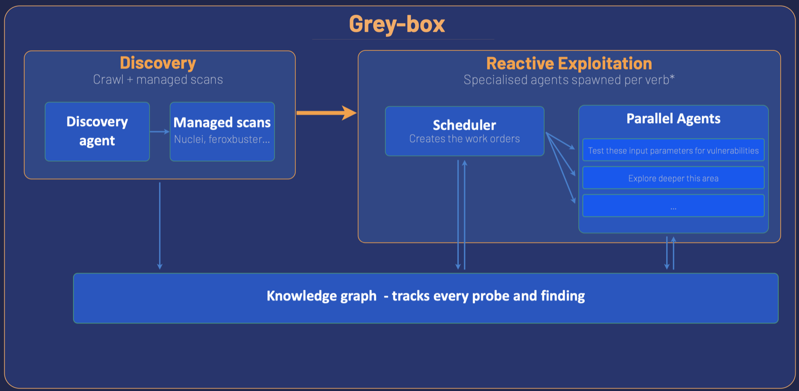

*Grey-box has no phase list to follow. **Discovery** (a crawling agent plus managed tool scans — Nuclei, feroxbuster) writes what it finds into the knowledge graph; the **scheduler** reads that graph and hands out work orders; the agents it spawns write their results straight back into the graph. The loop keeps going as long as the graph keeps changing.*

**The scheduler is plain Python, not an LLM.** It re-reads the graph on every tick, fires a fixed
set of rules against it, and emits *verbs* — concrete work orders that become agents:

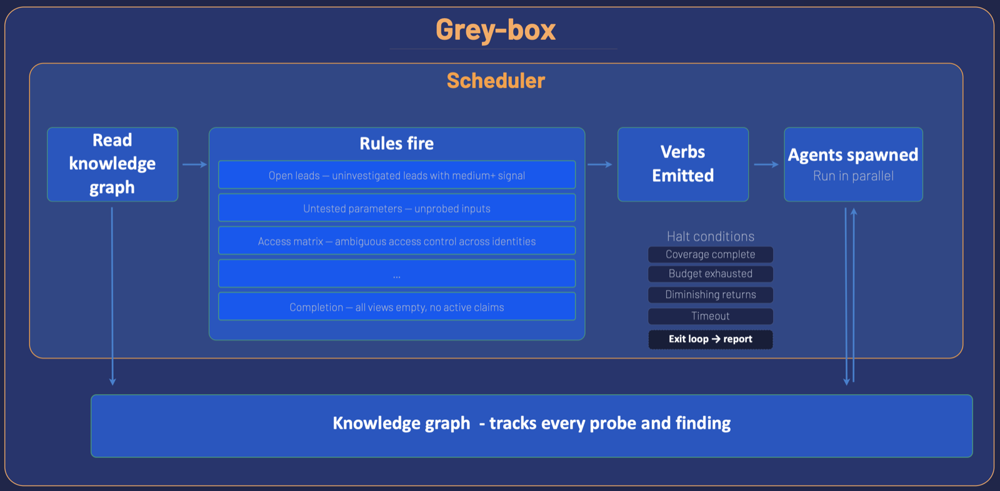

*Rules cover open leads with medium-or-better signal, parameters nobody has probed yet, and ambiguous access control across identities. The loop halts on coverage complete, budget exhausted, diminishing returns, or timeout — then writes the report. Keeping dispatch deterministic means a run is auditable: you can always ask why a given agent was spawned.*

Everything the run learns lives in the graph, and you can open it and look:

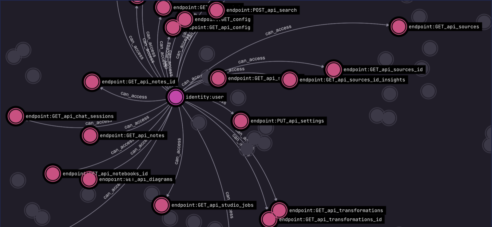

*The access matrix as stored: one identity, and every endpoint it was proven to reach. Comparing these across identities is what surfaces broken access control.*

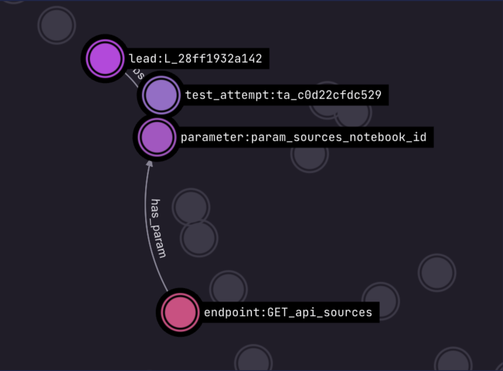

*Zoomed in on a single lead: which endpoint it came from, which parameter it concerns, and every attempt made against it. Nothing is retried blindly, and nothing is lost between agents.*

### Output

Each scan writes results into the target repo under `.vigilo/<session-id>/`: `workflow.log`,
`session.json` (cost/tokens/duration), per-agent logs, and a `deliverables/` directory containing
the structured JSON sidecars, `comprehensive_security_assessment_report.md`, patches, and
screenshots.

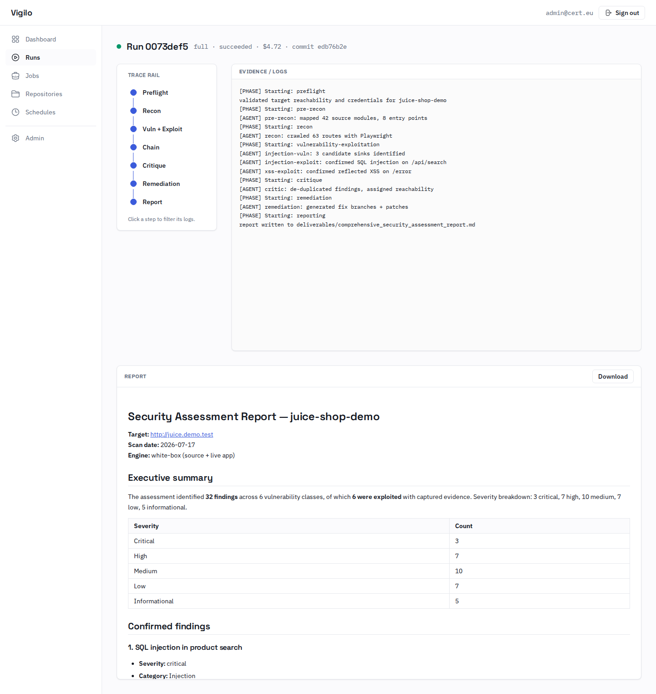

*A completed run: the full Trace Rail, captured evidence, and the rendered security assessment report (also downloadable as Markdown).*

---

## API reference

The platform is API-first (`src/webapi/`); the UI consumes only this API. The API serves
interactive OpenAPI docs at `/docs` (internal in the full stack; on the local fake-engine dev
server it's `http://localhost:8080/docs`). Selected endpoints:

**Auth / users / credentials / admin**
- `GET /health`, `GET /version`
- `POST /auth/jwt/login` (form: `username`, `password`) → `{access_token}`; `POST /auth/jwt/logout`
- `POST /auth/forgot-password`, `POST /auth/reset-password`, `POST /auth/accept-invite`
- `GET /users/me`, `POST /users/me/change-password`
- Admin: `POST /users`, `GET /users`, `PATCH /users/{id}`, `DELETE /users/{id}`, `POST /users/{id}/reset-password`
- Credentials (owner-private, secrets never returned): `POST`/`GET`/`DELETE /credentials`
- Admin config: `GET /admin/config`, `PUT /admin/config`
- Invitations: `POST`/`GET /invitations`, `DELETE /invitations/{id}`

**Repositories / jobs / runs**
- Repositories: `POST`/`GET /repositories`, `GET`/`PATCH`/`DELETE /repositories/{id}`,
  `POST /repositories/{id}/upload`, `POST /repositories/{id}/webhook`,
  `GET`/`POST`/`DELETE /repositories/{id}/access`
- Jobs: `POST`/`GET /jobs`, `GET`/`PATCH`/`DELETE /jobs/{id}`, `POST /jobs/{id}/run`
- Runs: `GET /runs`, `GET`/`DELETE /runs/{id}`, `POST /runs/{id}/cancel`
- Logs: `GET /runs/{id}/logs?offset=` (paged), `GET /runs/{id}/logs/stream` (SSE)
- Reports & artifacts: `GET /runs/{id}/report`, `GET /runs/{id}/artifacts[/{kind}]`

**Scheduling & webhooks**
- Schedules: `POST`/`GET /schedules`, `PATCH`/`DELETE /schedules/{id}` (`once` / `recurring` / `gitlab_mr`)
- `POST /webhooks/gitlab` (unauthenticated, `X-Gitlab-Token` verified) — MR events trigger matching schedules.

**Dashboards & metrics**
- `GET /dashboard/metrics`, `GET /runs/{id}/metrics`, `GET /repositories/{id}/metrics/timeline`

---

## Development

To work on Vigilo itself you don't need Docker, Temporal or Postgres. The API can run
in-process against SQLite with a **fake execution engine**, which lets you create
repositories and jobs, start runs and tail logs without launching a real scan.

```bash
python -m venv .venv-webapi && source .venv-webapi/bin/activate
pip install -e ".[webapi,webapi-test]"

export VIGILO_JWT_SECRET=dev-secret-please-change-me-32b
export VIGILO_FERNET_KEY=$(python -c "import base64,os;print(base64.urlsafe_b64encode(os.urandom(32)).decode())")
export VIGILO_FIRST_ADMIN_EMAIL=admin@example.com
export VIGILO_FIRST_ADMIN_PASSWORD=change-me-now
export VIGILO_EXECUTION_ENGINE=fake

python -m src.webapi.main          # http://localhost:8080/docs
```

Then start the web UI, which proxies `/api` to that API:

```bash
cd web && npm install && npm run dev      # http://localhost:5173
```

Tests and the frontend build gate:

```bash
pytest tests/webapi -q     # backend — in-memory SQLite, no external services
cd web && npm run build    # typecheck (tsc --noEmit) + production build
```

Schema changes go through **Alembic** (`src/webapi/alembic/versions/`), never `create_all`.
The API applies `alembic upgrade head` on boot; run it by hand with
`python -m scripts.run_migrations upgrade`.

Two things that trip people up: don't run the API with `uvicorn --reload` against SQLite
(the reloader's second process contends on the file), and the SPA talks to the API only
through the typed client in `web/src/api/client.ts`. See [`web/README.md`](web/README.md)
for the UI's screens and design language.

---

## Licence

Vigilo is distributed under the **European Union Public Licence v1.2 (EUPL-1.2)** — the European
Commission's default licence for Commission software. The full text is in [`LICENSE`](LICENSE).

```
Copyright © 2026 European Union
Licensed under the EUPL-1.2. See the LICENSE file for licensing information.
```

Third-party components retain their own licences.
